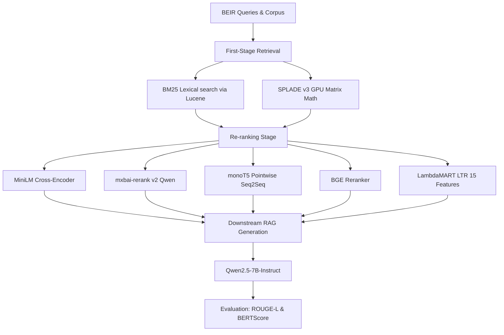

# RAG Re-Ranking Benchmark

[](https://www.python.org/)
[](https://pytorch.org/)
[](https://github.com/microsoft/LightGBM)
[](https://github.com/huggingface/transformers)
[](https://github.com/beir-cellar/beir)

Benchmarks re-ranking methods on top of two first-stage retrievers across BEIR datasets. The central question: can small local re-rankers match frontier models on domain-specific retrieval while keeping data private?

---

## Central Pipeline Architecture



---

## Empirical Benchmark Results

Below is the standard reporting template for zero-shot performance across the 6 BEIR datasets (*NQ, SciFact, TREC-COVID, NFCorpus, FiQA, Arguana*):

| First-Stage | Re-Ranker | NDCG@10 | MRR@10 | Latency (avg/p95) | ROUGE-L | BERTScore (F1) |
|---|---|---|---|---|---|---|
| **BM25** | *None (Baseline)* | 0.XXX | 0.XXX | - | 0.XXX | 0.XXX |
| **BM25** | MiniLM-L12 | 0.XXX | 0.XXX | XXms / XXms | 0.XXX | 0.XXX |
| **BM25** | mxbai-rerank-v2 | 0.XXX | 0.XXX | XXms / XXms | 0.XXX | 0.XXX |
| **BM25** | monoT5-base | 0.XXX | 0.XXX | XXms / XXms | 0.XXX | 0.XXX |
| **BM25** | BGE-base | 0.XXX | 0.XXX | XXms / XXms | 0.XXX | 0.XXX |
| **BM25** | LambdaMART (LTR) | 0.XXX | 0.XXX | XXms / XXms | 0.XXX | 0.XXX |
| **SPLADE** | *None (Baseline)* | 0.XXX | 0.XXX | - | 0.XXX | 0.XXX |
| **SPLADE** | MiniLM-L12 | 0.XXX | 0.XXX | XXms / XXms | 0.XXX | 0.XXX |
| **SPLADE** | mxbai-rerank-v2 | 0.XXX | 0.XXX | XXms / XXms | 0.XXX | 0.XXX |
| **SPLADE** | monoT5-base | 0.XXX | 0.XXX | XXms / XXms | 0.XXX | 0.XXX |
| **SPLADE** | BGE-base | 0.XXX | 0.XXX | XXms / XXms | 0.XXX | 0.XXX |
| **SPLADE** | LambdaMART (LTR) | 0.XXX | 0.XXX | XXms / XXms | 0.XXX | 0.XXX |

---

# Part 1 — The Experiment

## What Was Tested

Two first-stage retrievers produce top-100 candidate sets per query:

| First-stage | Method |
|---|---|
| BM25 | Sparse lexical retrieval via Pyserini/Lucene |
| SPLADE | Learned sparse retrieval (naver/splade-v3) |

Five re-rankers are then applied to each candidate set:

| Re-ranker | Model ID | Type |
|---|---|---|
| MiniLM | `cross-encoder/ms-marco-MiniLM-L-12-v2` | Cross-encoder |
| mxbai | `mixedbread-ai/mxbai-rerank-base-v2` | Cross-encoder (Qwen-based) |
| monoT5 | `castorini/monot5-base-msmarco-v2` | Seq2seq pointwise |
| BGE | `BAAI/bge-reranker-base` | Cross-encoder |
| LambdaMART | trained on MS MARCO | LTR, 15 hand-crafted features |

Evaluated on 6 BEIR subsets: **NQ, SciFact, TREC-COVID, NFCorpus, FiQA, ArguAna**.

IR metrics reported: NDCG@10, MRR@10, MAP@100, Recall@10, P@1. Statistical significance is tested with a paired t-test and Bonferroni correction against the unre-ranked baseline.

As a downstream task, Qwen2.5-7B-Instruct generates answers from the top-5 passages of each run, scored with ROUGE-L and BERTScore.

**LambdaMART is trained on MS MARCO only.** BEIR datasets are never seen during training, keeping the evaluation fully zero-shot.

---

## Environment

The experiment was run on **Linux** with an **NVIDIA RTX 5090** (CUDA 12.8). A CUDA-capable GPU is required — SPLADE encoding and re-ranking are GPU-bound and will be extremely slow on CPU. Python 3.10+ is recommended.

---

## Directory Structure

The code is distributed as a zip file. Extract it to get a single folder with the following layout. The `scripts/` directory is the only pre-existing subdirectory — all others (`datasets/`, `indexes/`, `models/`, `results/`) are created automatically when the pipeline runs.

```
.
├── scripts/                        # All runnable scripts (pre-existing)
│   ├── download_data.py            # Download BEIR datasets
│   ├── splade_encode.py            # Encode corpora with SPLADE-v3
│   ├── retrieve.py                 # SPLADE GPU retrieval
│   ├── run_rerankers.py            # Cross-encoder / monoT5 / mxbai re-ranking
│   ├── infer_lambdamart.py         # LambdaMART inference
│   ├── run_metrics.py              # IR metrics (NDCG, MRR, MAP, ...)
│   ├── run_generation.py           # RAG answer generation with Qwen2.5-7B
│   ├── run_gen_metrics.py          # ROUGE-L and BERTScore scoring
│   └── run_latency.py              # Per-query latency profiling
├── pipeline_t1_t3_t4_t5.py        # BM25 indexing + retrieval
├── t5_train_lambdamart.py          # LambdaMART training on MS MARCO
├── download_msmarco.py             # Download MS MARCO dataset
├── splade_prep.py                  # One-shot SPLADE setup (login + encode + retrieve)
├── run_phase0.py                   # Orchestrates BM25 + LambdaMART training
├── run_phase1.py                   # Orchestrates all re-ranking
├── setup.sh                        # Installs dependencies and logs in to HF
│
│   # Created automatically at runtime:
├── datasets/                       # BEIR subsets + MS MARCO
├── indexes/
│   ├── bm25/                       # Lucene indexes, one per dataset
│   └── splade/                     # Sparse vector indexes, one per dataset
├── models/
│   └── lambdamart/
│       ├── model.pkl
│       └── scaler.pkl
└── results/
    ├── candidates_bm25/            # {dataset}.json — top-100 BM25 hits
    ├── candidates_splade/          # {dataset}.json — top-100 SPLADE hits
    ├── reranked_bm25/              # {model_nickname}/{dataset}.json
    ├── reranked_splade/            # {model_nickname}/{dataset}.json
    ├── generated_bm25/             # {model_nickname}/{dataset}.json
    ├── generated_splade/           # {model_nickname}/{dataset}.json
    └── metrics/                    # CSV summaries
```

---

## Setup

```bash
bash setup.sh
```

Installs Java (required for Pyserini/BM25), all Python packages, and prompts for a Hugging Face token. Before running, accept the SPLADE-v3 model terms at https://huggingface.co/naver/splade-v3. All other models (MiniLM, mxbai, monoT5, BGE, Qwen2.5-7B) download automatically from HF on first use.

> **Note:** On some Linux environments you need to restart your shell after `setup.sh` for `java` to appear on PATH. If Pyserini fails with a Java error, open a new terminal and try again.

---

## Reproducing the Experiment

---

### Step 1 — Download Data

```bash
python scripts/download_data.py   # BEIR datasets
python download_msmarco.py        # MS MARCO (for LambdaMART training only)
```

Downloads NQ, SciFact, TREC-COVID, NFCorpus, FiQA, ArguAna into `datasets/beir/` and MS MARCO into `datasets/msmarco/`. BEIR datasets are never used for training — only for zero-shot evaluation.

---

### Step 2 — SPLADE Encoding and Retrieval

```bash
python splade_prep.py
```

Prompts for your HF token (needed for the gated SPLADE-v3 model), then:

1. **Encodes all 6 BEIR corpora** with SPLADE-v3 into sparse vectors at `indexes/splade/{dataset}_corpus.json`.
2. **Retrieves top-100 SPLADE candidates** per query, saved to `results/candidates_splade/{dataset}.json`.

This is the longest step in the pipeline. On an RTX 5090 with batch size 256 expect several hours across all 6 datasets.

---

### Step 3 — BM25 Indexing, Retrieval, and LambdaMART Training

```bash
python run_phase0.py
```

1. **BM25 indexing** — builds a Pyserini/Lucene index per dataset into `indexes/bm25/`. Requires Java on PATH.
2. **BM25 retrieval** — top-100 candidates per query saved to `results/candidates_bm25/{dataset}.json`.
3. **LambdaMART training** — extracts 15 features (BM25/SPLADE scores, reciprocal ranks, TF-IDF cosine, query coverage, etc.) from MS MARCO candidates and trains a LightGBM ranker. Outputs `models/lambdamart/model.pkl` and `models/lambdamart/scaler.pkl`.

> Steps 2 and 3 are fully independent and can run in parallel since they write to different directories.

---

### Step 3 — Re-Ranking

```bash
python run_phase1.py
```

Runs all five re-rankers on both BM25 and SPLADE candidate sets. Results are saved to `results/reranked_{bm25|splade}/{model_nickname}/{dataset}.json`. All re-rankers skip datasets already done, so it is safe to resume after a crash.

---

### Step 4 — IR Metrics

```bash
python scripts/run_metrics.py
```

Evaluates every (dataset × first-stage × re-ranker) combination with pytrec_eval. Prints an ASCII table and saves `results/metrics/summary_{bm25|splade}.csv`.

---

### Step 5 — Latency Profiling

```bash
python scripts/run_latency.py --model cross-encoder/ms-marco-MiniLM-L-12-v2
python scripts/run_latency.py --model mixedbread-ai/mxbai-rerank-base-v2
python scripts/run_latency.py --model castorini/monot5-base-msmarco-v2
python scripts/run_latency.py --model BAAI/bge-reranker-base
```

Measures per-query re-ranking latency (avg, median, P95) with a 5-query warmup. Output: `results/metrics/latency_{model_nickname}.csv`.

---

### Step 6 — RAG Generation and Generation Metrics

```bash
python scripts/run_generation.py
python scripts/run_gen_metrics.py
```

`run_generation.py` generates answers with Qwen2.5-7B-Instruct using the top-5 passages from each run, capped at 500 queries per dataset. `run_gen_metrics.py` scores them against gold-relevant documents with ROUGE-L and BERTScore (DeBERTa-xlarge). Output: `results/metrics/generation_scores_{stage}.csv`.

---

### Full Run Order

```bash
bash setup.sh                                                    # install deps
python scripts/download_data.py                                  # download BEIR datasets
python download_msmarco.py                                       # download MS MARCO
python splade_prep.py                                            # SPLADE encode + retrieve (hours)
python run_phase0.py                                             # BM25 + LambdaMART training
python run_phase1.py                                             # all re-rankers
python scripts/run_metrics.py                                    # IR evaluation
python scripts/run_latency.py --model cross-encoder/ms-marco-MiniLM-L-12-v2
python scripts/run_latency.py --model mixedbread-ai/mxbai-rerank-base-v2
python scripts/run_latency.py --model castorini/monot5-base-msmarco-v2
python scripts/run_latency.py --model BAAI/bge-reranker-base
python scripts/run_generation.py                                 # RAG generation
python scripts/run_gen_metrics.py                                # ROUGE + BERTScore
```

All stages are idempotent — already-completed outputs are skipped automatically, so it is safe to re-run after any interruption.

---
---

# Part 2 — Using Any Model on Any BEIR Subset

Every script accepts `--datasets` and `--first-stages` arguments so you can run any slice of the pipeline on any combination of datasets, retrievers, and re-rankers without touching the code.

## Supported Model Types

`run_rerankers.py` detects the model type from the model name and has three loading paths. A new model works out of the box only if it fits one of them — otherwise a new branch needs to be added to the script.

**Path 1 — Standard cross-encoders** (default catch-all)

Loaded via `sentence_transformers.CrossEncoder`. Works for `BAAI/bge-reranker-*`, the `cross-encoder/*` family (MiniLM, etc.), and most standard cross-encoders on HF. These expect `(query, document)` pairs and return a scalar score directly — no special prompting needed.

**Path 2 — monoT5** (triggered when model name contains `monot5`)

Loaded as `AutoModelForSeq2SeqLM`. Uses the standard monoT5 prompt (`Query: {q} Document: {d} Relevant:`) and scores by taking the log-probability difference between the `true` and `false` output tokens. Works for `castorini/monot5-*` checkpoints.

**Path 3 — mxbai-rerank v2** (triggered when model name contains both `mxbai` and `v2`)

Loaded as `AutoModelForSequenceClassification` from the repackaged checkpoint `michaelfeil/mxbai-rerank-base-v2-seq` (the original HF checkpoint is broken on transformers >= 5.x). Uses the exact Qwen chat template the model requires. Passing `mixedbread-ai/mxbai-rerank-base-v2` as `--model` triggers this path — the repackaged checkpoint is loaded internally regardless.

**What requires a code change:**

Any model that doesn't fit the above three patterns needs a new `elif` branch in `run_rerankers.py` covering its loading, prompt format, and score extraction. This includes:
- Decoder-only rerankers (Llama/Mistral-based) — wrong architecture for CrossEncoder, needs its own prompt and logit extraction
- Other seq2seq rerankers that aren't monoT5 — may use different prompt formats or token vocabularies
- mxbai v1 — the `v2` check would miss it and it would silently fall into the CrossEncoder path, giving wrong results

---

## Running a Single Re-ranker on Selected Datasets

```bash
# One model, two datasets, BM25 candidates only
python scripts/run_rerankers.py \
    --model BAAI/bge-reranker-base \
    --first-stage bm25 \
    --datasets scifact nq

# monoT5 on all datasets, SPLADE candidates
python scripts/run_rerankers.py \
    --model castorini/monot5-base-msmarco-v2 \
    --first-stage splade

# LambdaMART on a single dataset
python scripts/infer_lambdamart.py \
    --first-stage bm25 \
    --datasets trec-covid
```

---

## Running Phase 1 with Custom Models and Datasets

```bash
# Try a new model on two datasets, BM25 only, skip LambdaMART
python run_phase1.py \
    --models BAAI/bge-reranker-large \
    --first-stages bm25 \
    --datasets scifact fiqa \
    --skip-lambdamart

# Run the full default experiment but on one dataset
python run_phase1.py --datasets nq
```

---

## Evaluating After a Custom Run

Metrics, generation, and scoring all auto-discover what exists in `results/` — if you pass no arguments they evaluate everything present:

```bash
python scripts/run_metrics.py
python scripts/run_generation.py
python scripts/run_gen_metrics.py
```

Or scope them explicitly:

```bash
# Metrics for one dataset and one stage
python scripts/run_metrics.py \
    --datasets scifact \
    --first-stages bm25

# Score only specific rerankers (use the nickname — last segment of the HF model ID)
python scripts/run_metrics.py \
    --rerankers bge-reranker-base monot5-base-msmarco-v2

# Quick end-to-end test on a single dataset
python scripts/run_generation.py --datasets nq --first-stages bm25 --max-queries 100
python scripts/run_gen_metrics.py --datasets nq --first-stages bm25
```

---

## Latency Profiling for a New Model

```bash
python scripts/run_latency.py \
    --model BAAI/bge-reranker-large \
    --datasets scifact nq trec-covid
```

Output: `results/metrics/latency_{model_nickname}.csv`.

---

## Adding a New BEIR Dataset

Any dataset available in BEIR works. Download it first, then build its indexes:

```bash
# Download manually
python -c "
from beir import util
util.download_and_unzip(
    'https://public.ukp.informatik.tu-darmstadt.de/thakur/BEIR/datasets/hotpotqa.zip',
    'datasets'
)
"

# Build BM25 index and retrieve candidates
python pipeline_t1_t3_t4_t5.py t1
python pipeline_t1_t3_t4_t5.py t3

# Encode and retrieve with SPLADE
python scripts/splade_encode.py
python scripts/retrieve.py --method splade
```

Then pass the new dataset name to any downstream script via `--datasets hotpotqa`.

---

## Quick Reference — All Arguments

| Script | Arguments |
|---|---|
| `run_phase1.py` | `--models`, `--first-stages`, `--datasets`, `--skip-lambdamart` |
| `scripts/run_rerankers.py` | `--model`, `--first-stage`, `--datasets`, `--skip-latency` |
| `scripts/infer_lambdamart.py` | `--first-stage`, `--datasets` |
| `scripts/run_metrics.py` | `--datasets`, `--first-stages`, `--rerankers` |
| `scripts/run_latency.py` | `--model`, `--datasets` |
| `scripts/run_generation.py` | `--datasets`, `--first-stages`, `--rerankers`, `--max-queries` |
| `scripts/run_gen_metrics.py` | `--datasets`, `--first-stages`, `--rerankers` |
